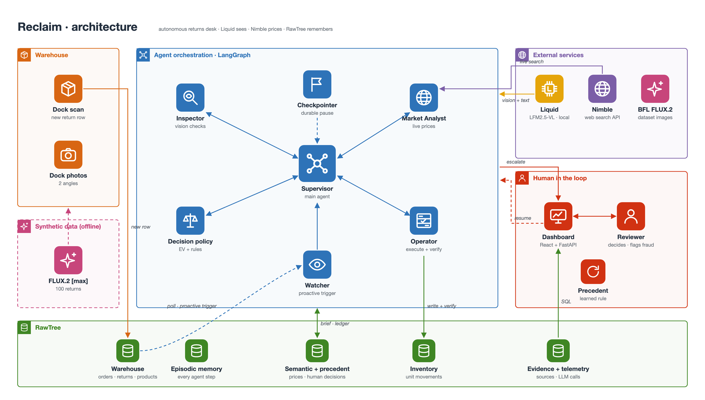
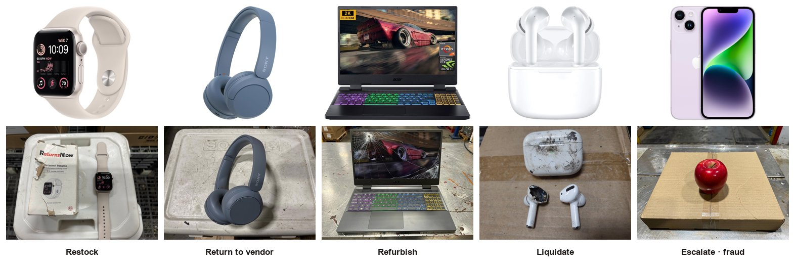

# Reclaim

Reclaim processes customer returns in a warehouse without a human in the loop for the routine cases. When a returned unit is scanned at the dock, an agent checks that the item is what was ordered, grades its condition, prices it on the live web, picks the highest-value disposition (restock, refurbish, return to vendor or liquidate), carries it out in the inventory ledger and verifies the result. It hands a case to a person only when it should, and it reuses that person's decision on similar cases.

Built in one day for the TokensAnd Long Horizon Agents Hack (San Francisco, Sep 25 2026) with **Liquid AI**, **Nimble**, **RawTree** and **Black Forest Labs**.



## The problem

US retailers expected **$849.9B** of returns in 2025, **15.8%** of sales, with an online return rate of **19.3%** ([NRF](https://nrf.com/media-center/press-releases/consumers-expected-to-return-nearly-850-billion-in-merchandise-in-2025)). Every returned unit raises the same questions:

* Is this the product we shipped, or a swap?
* What condition is it in?
* What is it worth today?
* Which disposition recovers the most value?

Warehouses answer these by hand, slowly, and often default to liquidating. Wrong-item fraud gets through when nobody looks closely.

## What Reclaim does

| | |
|---|---|
| **Trigger** | A new row in `reclaim_returns` (the dock scan). No prompt. |
| **Inspect** | Liquid LFM2.5-VL-3B runs on the laptop. It describes the dock photo without being told what was ordered, then compares it with the catalog photo. Code rules catch non-electronic objects, the wrong product family, and expensive items with no identity evidence. |
| **Price** | Two Nimble web searches collect new, used, refurbished and open-box prices. Liquid extracts them; code keeps a price only if it appears in the source text and is plausible. |
| **Decide** | Expected net recovery per action from live prices, vendor terms and a cost model. Hard constraints decide what is legal. |
| **Act** | Writes the disposition to the RawTree inventory ledger and verifies it by reading it back. |
| **Escalate** | Wrong item, unverified identity, a claim of $300 or more that the photos cannot verify, or a close call. The LangGraph run pauses durably until a person decides in the dashboard. That decision becomes precedent for similar cases. |

Top row: the catalog photo of what was ordered. Bottom row: the photo taken at the dock (generated with FLUX.2 [max] from the catalog photo). Below each pair: what the agent did.



## Architecture

* **Supervisor** (LangGraph `StateGraph`, one thread per return). It owns the case from dock to closure. A deterministic `allowed_next()` lists the legal next steps; the Liquid model chooses only at real branch points, such as thin price evidence. A SQLite checkpointer makes `interrupt()` durable, so a paused case survives restarts and resumes where it stopped.
* **Sub-agents**, each a compiled LangGraph subgraph:
  * **Inspector:** blind look, catalog profile, text-only verify, guard rules, and a re-inspection with a second photo when unsure.
  * **Market Analyst:** Nimble search, Liquid extraction, validation, and a 6-hour price memory.
  * **Decision policy:** expected value, constraints, escalation rules, human precedent. Unit-tested.
  * **Operator:** executes the disposition and verifies it.
* **Watcher:** polls RawTree and opens a case for every new return.
* **Model:** `LiquidAI/LFM2.5-VL-3B-GGUF` (F16) served locally by `llama.cpp` from `./models`. One model handles vision and text; every output is constrained by a JSON schema.
* **RawTree** is the system of record and the agent's memory. It is append-only, so current state comes from `argMax` projections, and every table is prefixed `reclaim_` (the client refuses SQL outside that prefix).

| RawTree table | Role |
|---|---|
| `products` · `orders` · `returns` · `vendors` · `cost_model` | warehouse record (8,693 real catalog products) |
| `inventory` | every unit movement: dock, shelf, bench, RTV staging, cage, quarantine |
| `mem_events` | episodic ledger: every Supervisor, sub-agent and tool step (the dashboard timeline) |
| `mem_knowledge` | price facts with a 6-hour TTL, shared across cases |
| `mem_decisions` | all decisions; rows decided by a human are precedents |
| `mem_evidence` | every web price with URL, query and fetch time, accepted or rejected |
| `llm_calls` · `eval_gt` · `dataset` · `dataset_images` | telemetry, ground truth (never read by agents), synthetic dataset |

Each LLM call gets a brief of about 150 tokens rebuilt from these tables, so the context stays small however long the ledger grows.

## Data

**Catalog.** [`milistu/AMAZON-Products-2023`](https://huggingface.co/datasets/milistu/AMAZON-Products-2023) (derived from McAuley Lab's Amazon Reviews 2023), Electronics and Cell Phones, priced rows only: 8,693 products. We dropped the embeddings and marketing text, parsed brand, model and weight, and mapped the category path to 14 categories with device and repairable flags.

**Synthetic returns.** `backend/dataset/returns_100.csv` holds 100 returns: 5 categories × 20 products, with 4 per final action in each category. Each row has a return reason, the FLUX.2 [max] prompt that turns the catalog photo into the returned unit (cracked screen, torn cushion, crushed box, wrecked unit, knock-off swap, and one apple), and the expected identity, grade, defect, action and rule. The split is stratified 90/10. Images are stored locally and in RawTree (`reclaim_dataset_images`). The 5 demo returns:

| id | category | product | customer reason | expected |
|---|---|---|---|---|
| DS001 | phone | Apple iPhone 14, 128GB, Purple - Unlocked (Renew | Phone won't turn on. | ESCALATE |
| DS025 | laptop | Acer Nitro 5 Gaming Laptop 2023 Newest, 15.6" QH | The display cracked in my backpack, laptop still boots. | REFURBISH |
| DS053 | headphones | Sony WH-CH520 Wireless Headphones Bluetooth On-E | Left side has no sound. | RETURN_TO_VENDOR |
| DS069 | earbuds | Wireless Earbuds, Bluetooth 5.2 Headphones Mini  | Fell down the stairs and broke apart. | LIQUIDATE |
| DS097 | smartwatch | Apple Watch SE (2nd Gen) (GPS, 40mm) - Starlight | The box arrived crushed but the item inside is fine. | RESTOCK |

**Inventory ledger** from a real run of the 5 demo returns. Each unit's current location is the latest row:

| unit | sku | location | state | document |
|---|---|---|---|---|
| U-RMA-DS097 | B0BRQVVZRY | RECEIVING_DOCK | RECEIVED | — |
| U-RMA-DS097 | B0BRQVVZRY | OPEN_BOX_SHELF | SELLABLE_OPEN_BOX | LIS-RMA-DS097 |
| U-RMA-DS001 | B0BZ9N1QQC | RECEIVING_DOCK | RECEIVED | — |
| U-RMA-DS001 | B0BZ9N1QQC | QUARANTINE | HOLD_FOR_REVIEW | — |
| U-RMA-DS053 | B0BWK6B2T4 | RECEIVING_DOCK | RECEIVED | — |
| U-RMA-DS053 | B0BWK6B2T4 | RTV_STAGING | AWAITING_PICKUP | AUT-RMA-DS053 |
| U-RMA-DS025 | B0C7L6YG34 | RECEIVING_DOCK | RECEIVED | — |
| U-RMA-DS025 | B0C7L6YG34 | REFURB_BENCH | AWAITING_REPAIR | ORD-RMA-DS025 |
| U-RMA-DS069 | B0CFDZ8QPS | RECEIVING_DOCK | RECEIVED | — |
| U-RMA-DS069 | B0CFDZ8QPS | LIQUIDATION_CAGE | LOTTED | LOT-RMA-DS069 |

Vendor return terms and the cost model are synthetic and labelled as such.

## Results

**23 hand-labelled scenario returns** (`backend/scenarios/returns.json`):

| Metric | Result |
|---|---|
| Correct action | 91.3% (21/23) |
| Wrong-item returns sent to a human | 6 of 7 |
| Unsafe auto-resolves | 1 (no-name look-alike earbuds) |
| Needless escalations | 0 |
| Extra value vs liquidating everything | +$1,861 |

**FLUX dataset, full end-to-end runs.** 49 of 100 returns were processed before the deadline: phones, laptops and part of headphones, since cases run in order.

| Metric | Result |
|---|---|
| Correct action | 67.3% |
| Condition grade within one step | 100% |
| Extra value vs liquidating everything | +$6,609 |
| Needless escalations | 11 |
| Unsafe auto-resolves | 3 |

Most misses are the Inspector being cautious about identity and escalating. Throughput is about 35–40 s per case on an M1 Pro with F16 weights: the model decodes about 15–20 tokens/s and each case emits about 500 JSON tokens. Quantized weights are the obvious next step.

## Run it

Requirements: macOS or Linux, [uv](https://docs.astral.sh/uv/), Node 20+, `llama.cpp` (`brew install llama.cpp`).

1. **Weights.** Download `LFM2.5-VL-3B-F16.gguf` and `mmproj-LFM2.5-VL-3B-F16.gguf` from [LiquidAI/LFM2.5-VL-3B-GGUF](https://huggingface.co/LiquidAI/LFM2.5-VL-3B-GGUF) into `./models/`.
2. **Keys.** Put them in `.env` at the repo root:
   ```
   RAWTREE_API_KEY=...
   NIMBLE_API_KEY=...
   BFL_API_KEY=...   # only needed to regenerate the synthetic dataset
   ```
3. **Start the model, API and dashboard:**

```bash
backend/scripts/serve_model.sh          # llama.cpp server on :8080
```

```bash
cd backend && uv sync && uv run scripts/seed_catalog.py && uv run scripts/build_dataset.py
```

```bash
cd backend && uv run uvicorn reclaim.api:app --port 8000
```

```bash
cd frontend && npm install && npm run dev   # http://localhost:5173
```

In the dashboard, press **START SHIFT**. Five returns arrive; the agent handles each one and the apple waits in the escalation inbox.

To score a full run against ground truth, use `uv run scripts/eval_dataset.py`, or `scripts/run_headless.py all` for the scenario set.

## Repository

```
backend/reclaim/agents/   supervisor, inspector, market, operator (LangGraph)
backend/reclaim/          decision policy, memory, warehouse, RawTree client, runtime, API, dataset, FLUX client
backend/scripts/          serve_model.sh, seeding, dataset build, evaluation
backend/dataset/          returns_100.csv (synthetic returns + labels)
frontend/                 React + Tailwind dashboard
assets/                   architecture diagrams and README images
models/                   GGUF weights (not committed)
```

## Limitations

* Dock photos are generated, not taken from real returns.
* Vendor terms and costs are illustrative.
* A 3B model misreads look-alike products; that is why identity has code-level guard rules and escalates expensive items it cannot confirm.
