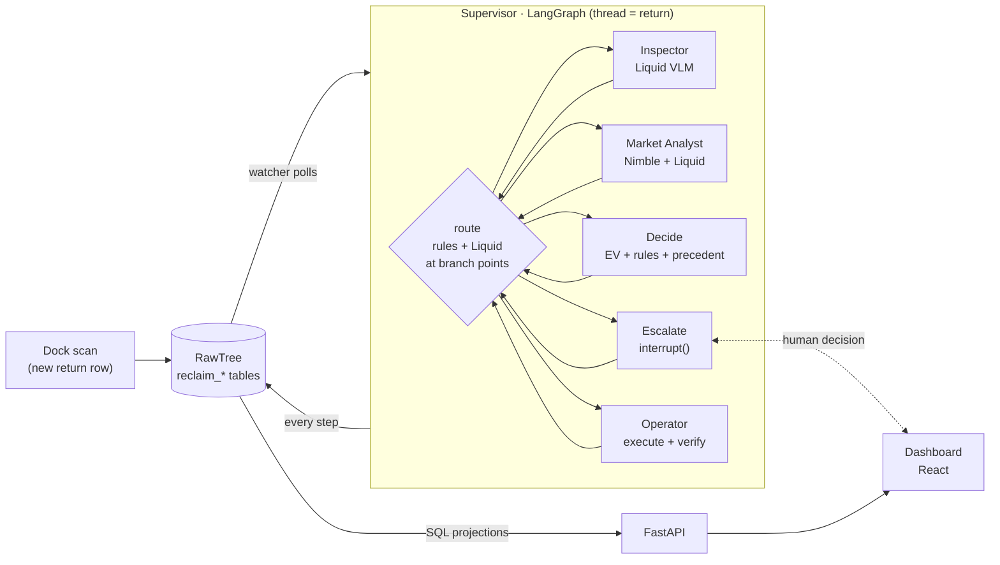

# Reclaim

**An autonomous returns desk.** When a defective return reaches the warehouse dock, Reclaim takes the case on its own: it checks what actually came back with an on-device vision model, prices it against the live web, picks the highest-value disposition (restock, refurbish, return to vendor or liquidate), executes it in the warehouse ledger and verifies the result. It escalates to a human only when it should, and every human decision becomes precedent for the next case.

> **Liquid sees · Nimble prices · RawTree remembers.**

Built solo in one day for the TokensAnd **Long Horizon Agents Hack** (San Francisco, Sep 25 2026).

---

## Why

US retailers expected **$849.9B** in returns in 2025, **15.8%** of annual sales, with an online return rate of **19.3%** ([NRF, Oct 2025](https://nrf.com/media-center/press-releases/consumers-expected-to-return-nearly-850-billion-in-merchandise-in-2025)). A return is not finished when the refund is issued: someone has to look at the item, work out what it is worth *today*, and decide what to do with it. That decision is slow, manual, and often defaults to "liquidate everything". Return fraud (an apple in the iPhone box) slips through when nobody looks.

## What it does

1. **Proactive trigger.** A new row in `reclaim_returns` (the dock scan) starts the agent. Nobody types a prompt.
2. **Inspector (Liquid LFM2.5-VL-3B, on-device).** A *blind* pass describes the dock photo without being told what was ordered, the catalog photo gets the same description, and a text-only Liquid call compares the two against the order. Code-level guard rules catch what a 3B model misses: a non-electronic object, the wrong product family, missing identity evidence on expensive items. Low confidence triggers a re-inspection with the next photo.
3. **Market Analyst (Nimble).** Two live web searches for new and second-hand prices; Liquid extracts prices; every price must literally appear in the retrieved text and be plausible, or it is rejected. Prices are remembered for 6 hours so later cases for the same SKU skip the web.
4. **Decide (deterministic policy).** Expected net recovery per action from live prices, vendor terms and a cost model; hard constraints decide what is legal; escalation rules decide when a human must look (identity mismatch, unverified identity, a high-value claim photos cannot verify, a close call). A matching human precedent resolves a judgment call automatically.
5. **Human in the loop.** Escalations pause the LangGraph run durably (`interrupt()` + SQLite checkpointer). The dashboard inbox shows the evidence packet; the human picks an action, can flag fraud, and the run resumes exactly where it stopped.
6. **Operator.** Writes the disposition to the RawTree inventory ledger (open-box shelf, refurb bench, RTV staging, liquidation cage) and verifies it by reading it back.

## Architecture



* **Main agent + sub-agents.** The Supervisor is a LangGraph `StateGraph`; each sub-agent is its own compiled subgraph (`backend/reclaim/agents/`). Routing has two layers: `allowed_next()` lists the legal next steps deterministically; when more than one is legal (e.g. thin price evidence: research more or decide with estimates) the Liquid model chooses and states why.
* **Rules decide what is legal, the model chooses among legal options.** Money maths and hard constraints are deterministic and unit-tested (`backend/reclaim/decision.py`), which is what keeps a 3B local model reliable.
* **Everything is visible.** Every Supervisor choice, sub-agent result and tool call is a row in `reclaim_mem_events`; the dashboard timeline *is* the ledger.

## Memory: long horizon without drowning in history

| Memory | RawTree table | Used for |
|---|---|---|
| Episodic | `reclaim_mem_events` | full ledger per case; the UI timeline |
| Semantic | `reclaim_mem_knowledge` | price facts with a 6 h TTL, shared across cases |
| Precedent | `reclaim_mem_decisions` (`decided_by = human`) | human judgment reused on similar cases |
| Evidence | `reclaim_mem_evidence` | every web price with URL, query and fetch time, accepted or rejected |
| World state | `reclaim_inventory` | append-only unit movements; current state via `argMax` projections |
| Working | the *brief* (never stored) | a ~150-token summary rebuilt from SQL for each LLM call |

RawTree is append-only (read-only SQL, no UPDATE/DELETE), so all state is event-sourced and memory is namespaced per run (a "shift"). Escalations can wait for hours: the graph checkpoint survives restarts, and the API resumes unfinished cases on boot. The context sent to the model stays around 150 tokens per call no matter how long the ledger grows (the dashboard shows both numbers).

## Sponsor tools

| Tool | What it does in Reclaim |
|---|---|
| **Liquid AI** · LFM2.5-VL-3B (F16 GGUF via LM Studio, on-device) | blind inspection of dock photos, catalog profiles, identity verification, price extraction from web text, Supervisor routing at branch points, decision rationales. One model for vision and text. |
| **Nimble** · Web Search API | live new / used / refurbished / open-box prices with sources; results feed the decision and are stored as evidence |
| **Black Forest Labs** · FLUX.2 [max] | turns real catalog photos into photos of returned units (cracked screens, torn cushions, crushed boxes, knock-off swaps, one apple) for a 100-return synthetic dataset |
| **RawTree** (Tinybird) | system of record *and* agent memory: catalog, orders, returns, inventory ledger, every agent event, knowledge, precedents, evidence, LLM telemetry, evaluation. Every table is prefixed `reclaim_` and the client refuses SQL outside that prefix (shared cluster). |

## Evaluation

23 labelled returns (7 demo + 16 evaluation) with ground truth written against a rubric (`backend/scenarios/returns.json`). The agent never reads ground truth; `backend/reclaim/evaluation.py` joins it afterwards.

| Metric | Result |
|---|---|
| Action accuracy vs the rubric | **91.3%** (21 of 23) |
| Wrong-item / fraud cases escalated to a human | **85.7%** (6 of 7) |
| Unsafe auto-resolves (should have gone to a human) | **1** |
| False escalations (bothered a human for nothing) | **0** |
| Identity accuracy | 87.0% |
| Condition grade: exact / within one step | 75.0% / 93.8% |
| Extra value recovered vs "liquidate everything" | **+$1,861** |
| Average time from arrival to decision | 21.9 s (local 3B model on an M1 Pro laptop) |

The two misses are instructive:
* **E06, the unsafe one:** no-name look-alike earbuds returned for Bose QC Earbuds II, with no branding visible. Described in words, the two are nearly identical and the model accepted them. This is where a fine-grained visual check (or a fine-tuned model) goes next.
* **E12, live data changed the answer:** a cracked 2023 phone labelled REFURBISH using its catalog price. Live prices put it at $137 new today, so a $55 screen repair barely pays and the agent liquidated it (EV $12.62 vs $11.62). The rubric's own logic, applied to today's prices, agrees with the agent.

The safety metric that matters most is **unsafe auto-resolves**: cases that should have gone to a human but were executed automatically.

## Synthetic returns dataset (FLUX.2)

`backend/dataset/returns_100.csv` holds 100 returns built from real catalog products: **5 categories** (phone, laptop, headphones, earbuds, smartwatch) × **20**, and within each category **4 per final action** (restock, refurbish, return to vendor, liquidate, escalate). So the set is balanced by product and by label.

Each row carries the product, a customer return reason, the FLUX.2 [max] edit prompt that turns the catalog photo into the photo of the returned unit, and the expected identity, grade, defect class, action and rule. The scenario depends on the price band: cheap items get wrecked and liquidated; repairable mid-to-high items get a cracked screen or torn cushion and are refurbished; intact items with functional claims go back to the vendor; items of $300 or more with claims a photo can't verify, plus knock-off swaps, are escalated. Exactly one return is the apple.

The split is stratified 90 train / 10 test (2 per action), with 5 of the test items (one per action, one per category) marked for the demo. Images are stored locally and in RawTree: `reclaim_dataset` holds labels and metadata, and `reclaim_dataset_images` holds a base64 JPEG per row. Rebuild or top up with `uv run scripts/build_dataset.py`.

## Data

* **Catalog:** [`milistu/AMAZON-Products-2023`](https://huggingface.co/datasets/milistu/AMAZON-Products-2023) (derived from McAuley Lab's [Amazon Reviews 2023](https://amazon-reviews-2023.github.io/)), Electronics + Cell Phones & Accessories, priced rows only: **8,693 products** in `reclaim_products`. Cleaning (`backend/reclaim/catalog.py`): dropped embeddings, marketing descriptions and raw detail blobs; parsed brand, model and weight; mapped the category path to 14 categories with device / repairable flags; flagged renewed listings.
* **Synthetic (labelled as such):** vendor return terms, the per-category cost model, customers, orders, return reasons, and dock photos. The dataset has one clean image per product and no photos of damaged units, so dock photos are generated from the catalog image (cut-out, warehouse surface, rotation, lighting, crack/scratch overlays) or taken from Wikimedia Commons: *Red Apple* by Abhijit Tembhekar (CC BY 2.0) and *Brick* by Andrewlister (public domain).

## Run it

Prerequisites: [uv](https://docs.astral.sh/uv/), Node 20+, [LM Studio](https://lmstudio.ai/) with `LiquidAI/LFM2.5-VL-3B-GGUF` loaded as `lfm2.5-vl-3b`, and a `.env` in the repo root:

```bash
RAWTREE_API_KEY=...
NIMBLE_API_KEY=...
```

```bash
cd backend
uv sync
uv run scripts/seed_catalog.py        # catalog + vendors + cost model -> RawTree
uv run scripts/prepare_images.py      # catalog images + synthetic dock photos -> data/images
uv run pytest -q                      # decision policy tests
uv run uvicorn reclaim.api:app --port 8000
```

```bash
cd frontend
npm install
npm run dev                           # http://localhost:5173
```

In the dashboard: **New shift** (warm-up returns arrive and resolve on their own), then **Truck arrives ▸** (the apple, the laptop close call and its look-alike). Headless end to end, scored against ground truth: `uv run scripts/run_headless.py all` (or score any run with `uv run scripts/evaluate.py <run_id>`).

## Repo layout

```
backend/reclaim/
  agents/supervisor.py   main agent: routing, escalation (interrupt), resume
  agents/inspector.py    Liquid VLM sub-agent
  agents/market.py       Nimble sub-agent
  agents/operator.py     warehouse sub-agent
  decision.py            EV, constraints, escalation rules, precedent (tested)
  memory.py              agent memory tables + brief builder
  warehouse.py           catalog / orders / returns / inventory
  rawtree.py             RawTree client (prefix-scoped, async ledger writes)
  runtime.py             worker + proactive watcher
  api.py                 FastAPI for the dashboard
backend/scenarios/returns.json   labelled returns + rubric
frontend/                        React + Tailwind dashboard
```

## Honest notes

* Dock photos are synthetic (see Data). Identity checks on real photos of real returns would need more evaluation.
* Cost model and vendor terms are illustrative numbers, not a real retailer's.
* A 3B model misreads things; that is why identity uses one image per call, code-level guard rules, OCR-tolerant brand matching and a human for anything expensive that cannot be confirmed.
